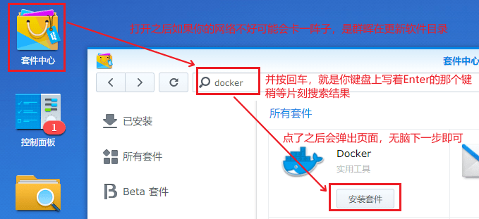
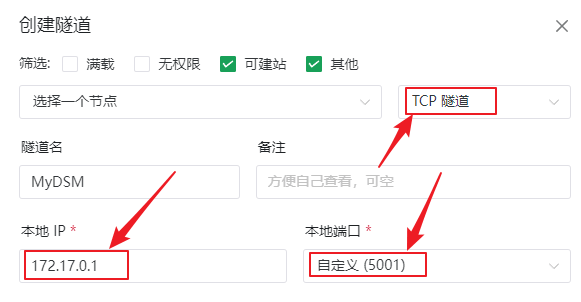
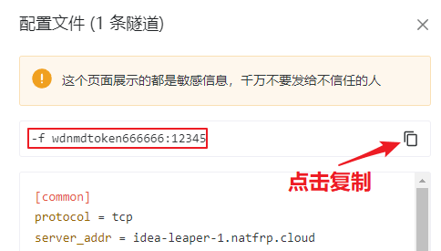
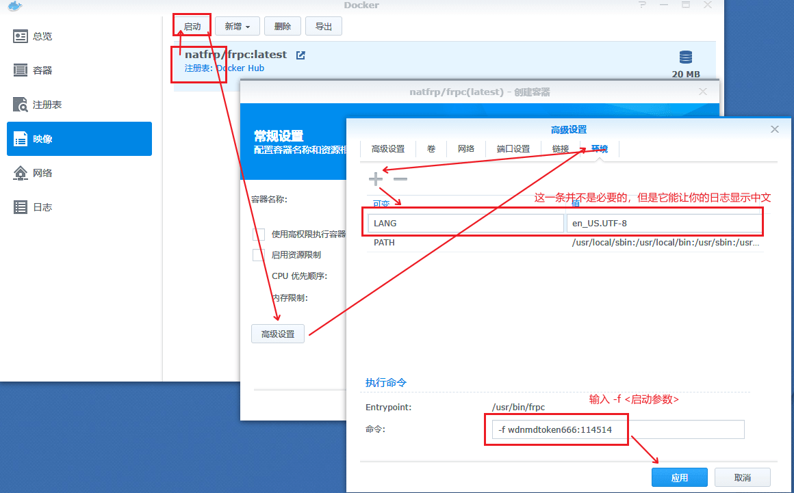
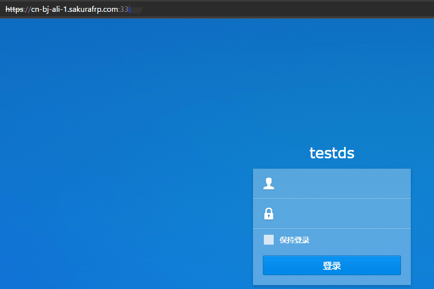

# 群晖 (Synology) NAS 穿透指南 (DSM 6)

## 查看本地端口 {#local-port}

启动 **控制面板** 应用，找到 `连接性 > 网络 > DSM 设置 > DSM 端口 > HTTPS`，记下这里的端口作为 **本地端口**。

如果您没有进行过修改，本地端口一般是 `5001`。请直接忽略上面的 HTTP 端口，这篇文档采用的是 HTTPS 协议。


## 安装 frpc 并启动隧道 {#install-frpc-and-start}

:::: tabs

@tab Docker 安装

::: tip
Docker 套件和镜像只要安装一次即可，无需重复操作。如需更新 frpc，请删除原有镜像并重新下载一次
:::

### 安装 Docker 套件和镜像 {#docker-install-docker-image}

1. 如果您的系统里没有 Docker 套件，请安装 Docker 套件：

   

1. 转到 **注册表** 页面，搜索 `natfrp`，选中 **natfrp/frpc** 并点击 **下载**，标签选择 `latest`：

   

1. 稍等片刻，直到右上角出现 **download is complete** 的通知，镜像就安装完成了：

   

### 创建隧道 {#docker-create-tunnel}

1. 打开 Docker 套件的 **网络** 页面，查看 `bridge` 网络的 **子网**，把 **最后一个** `0` 换成 `1` 作为 **本地 IP**。

   举个例子，子网 `172.17.0.0/16` 对应的 **本地 IP** 就是 `172.17.0.1`。

   

1. 前往 Sakura Frp 管理面板使用之前获取到的信息创建一条 **TCP 隧道**，红框部分为必填：

   

1. 在隧道列表中点击刚才创建的隧道右边三个点，选择 **配置文件** 并在弹出的对话框中复制隧道的 **启动参数**：

   

### 启动隧道 {#docker-start-tunnel}

1. 按图示配置就行，在 **命令** 处直接粘贴刚才复制的启动参数：

   

1. 连接信息在 docker 实例的日志中，跟着图片打开它，您就能看到，两个连接方式都能用：

   

1. 在连接方式前面加上 `https://`，打开浏览器，试一下：

   

1. 此外，群晖的编辑容器中有「启用自动重启启动」的选项，该选项默认关闭，建议打开它来实现开机自启：

   

@tab 直接安装

::: warning 安全提示
直接安装 frpc 需要通过 SSH 连接到您的 NAS，建议在配置完成后关闭 SSH 功能
:::

### 创建隧道 {#direct-create-tunnel}

前往 Sakura Frp 管理面板创建一条 **TCP 隧道**，**本地IP** 留空使用默认值，**不要往里面填任何东西**：


### 启用 SSH 功能 {#direct-enable-ssh}

1. 启动 **控制面板** 应用，转到 `应用程序 > 终端机和 SNMP`，确保 SSH 功能已启用并记下这里的 SSH 端口 (例如 `22`)：

   

1. 通过此处的 SSH 端口和您登录 DSM 管理面板的帐号密码连接到 SSH 终端，使用 `sudo -i` 命令提升到 root 权限，您可能需要再输入一次 DSM 管理面板的密码。

   ::: tip
   如果您需要一个 SSH 客户端，可以从这里下载：[PuTTY](https://www.chiark.greenend.org.uk/~sgtatham/putty/latest.html)
   :::

### 安装 frpc 和服务 {#direct-install-frpc}

1. 请先参考 [Linux 使用教程/安装 frpc](/frpc/usage.md#linux-install-frpc) 一节安装 frpc。

1. 然后执行下面的命令编辑配置文件：

   ```bash
   vim /etc/init/frpc.conf
   ```

1. 按一下 `i` 键，左下角应该会出现 `-- INSERT --` 或者 `-- 插入 --` 字样

   

1. 粘贴下面的内容即可，注意把文件底部的启动参数换成您的启动参数：

   ::: tip
   如果您按照本文档进行配置并使用了下面的内容，frpc 会在系统启动时自启并在出错时自动重启
   :::

   ```bash
   description "SakuraFrp synology frpc service"

   author "iDea Leaper"

   start on syno.network.ready
   stop on runlevel [016]

   respawn
   respawn limit 0 5

   exec /usr/local/bin/frpc -f <您的启动参数，如 wdnmdtoken666666:12345，不要带尖括号>
   ```

1. 粘贴完成后按一下 `ESC` 键，左下角的 `-- INSERT --` 会消失，此时输入 `:wq` 并按回车退出 vim

### 测试服务 {#direct-test-service}

1. 执行下面的命令测试 frpc 是否能正常运行

   ```bash
   start frpc
   tail /var/log/upstart/frpc.log
   ```

1. 如果您看到了图中的两个提示，则 frpc 已安装完毕并可以正常使用了

   

1. 现在您可以通过 `https://` 加上连接方式来访问 DSM 面板了：

   

::::
