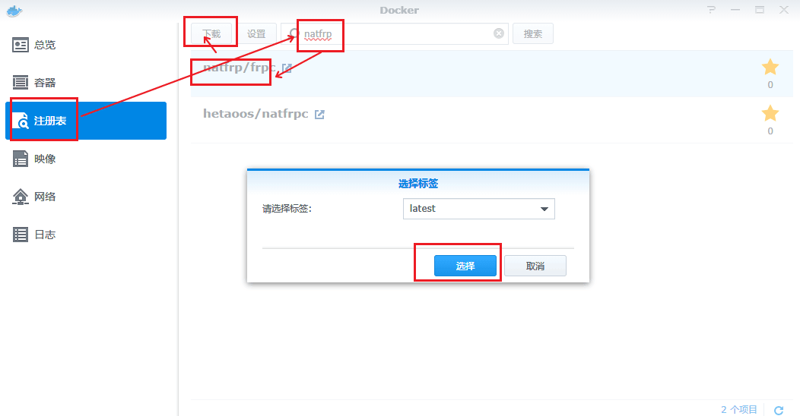
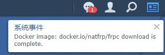
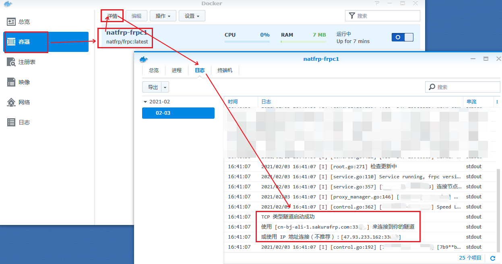

# 群晖(Synology) NAS 穿透指南 (DSM 6)

## 使用准备

启动 **控制面板** 应用，找到 `连接性 > 网络 > DSM 设置 > DSM 端口 > HTTPS`，记下这里的端口作为 **本地端口**。


## Docker 安装

### 安装 Docker 套件和镜像

?> Docker 套件和镜像只要安装一次即可，无需重复操作。如需更新 frpc，请删除原有镜像并重新下载一次

如果您的系统里没有 Docker 套件，请安装 Docker 套件：


转到 **注册表** 页面，搜索 `natfrp`，选中 **natfrp/frpc** 并点击 **下载**：



稍等片刻，直到右上角出现 **download is complete** 的通知，镜像就安装完成了：



### 创建隧道

因为 docker 网络模型的原因，我们像从前一样把隧道的 本地IP 设置为 `127.0.0.1` 已经不再奏效，必须修改设置中的此项。

此处需要分情况讨论：
 - 当修改为 `host` 宿主网络模式时，只需要设置为上级网关分配给当前设备的 IP 即可（人话：设置为路由器给群晖的 IP）
 - 当保持默认的 `bridge` 网桥模式时，我们需要设置为对应网桥的网关 IP 才能恰当的访问当前设备，因为该方案兼容性和安全性更高，**下面的教程默认采用此方案**

首先打开群晖的 Docker 应用，根据图上的方法算出我们需要的 IP，即 网关 IP


前往 Sakura Frp 管理面板使用之前获取到的信息创建一条 **TCP 隧道**：


然后点击右边的三个点，选择 **配置文件** 并在弹出的对话框中复制隧道的 **启动参数**：


### 启动隧道

按图示配置就行，在 **命令** 处直接粘贴刚才复制的启动参数：


连接信息在 docker 实例的日志中，跟着图片打开它，你就能看到：



打开浏览器，试一下：


### 注意事项

群晖的编辑容器中有「启用自动重启启动」的选项，该选项默认关闭，建议打开它


## 直接安装

首先，前往 Sakura Frp 管理面板创建一条 **TCP 隧道**，**本地IP** 留空使用默认值：


### 安装 frpc

启动 **控制面板** 应用，转到 `应用程序 > 终端机和 SNMP`，确保 SSH 功能已启用并记下这里的 SSH 端口


然后通过此处的 SSH 端口和您登录 DSM 管理面板的帐号密码连接到 SSH 终端，使用 `sudo -i` 命令提升到 root 权限，您可能需要再输入一次 DSM 管理面板的密码。

接下来请参考 [Linux 使用教程](/frpc/usage/linux) 中的 **安装 frpc** 一节安装 frpc。

### 配置服务文件

执行下面的命令编辑配置文件

```bash
# vim /etc/init/frpc.conf
```

?> 如果您按照本文档进行配置并使用了下面的内容，frpc 会在系统启动时自启并在出错时自动重启，无需额外配置

直接写入下面的内容即可，注意把文件中的启动参数换成您的启动参数

```upstart
description "SakuraFrp synology frpc service"

author "iDea Leaper"

start on syno.network.ready
stop on runlevel [016]

respawn
respawn limit 0 5

exec /usr/local/bin/frpc -f <您的启动参数，如 wdnmdtoken666666:12345>
```

### 测试服务

执行下面的命令测试 frpc 是否能正常运行

```bash
# start frpc
# tail /var/log/upstart/frpc.log
```

如果您看到了图中的两个提示，则 frpc 已安装完毕并可以正常使用了


现在您可以通过 `https://<节点域名>:<远程端口>` 的方式访问 DSM 面板，也可以使用 `https://<日志中标出的连接方式>` 访问，推荐使用节点域名

在本示例中，我使用的是 `https://cn-bj-bgp.sakurafrp.com:39147`


