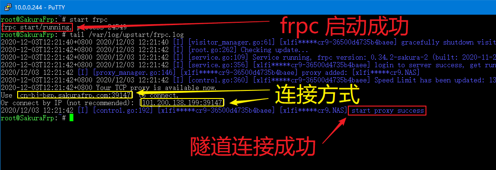
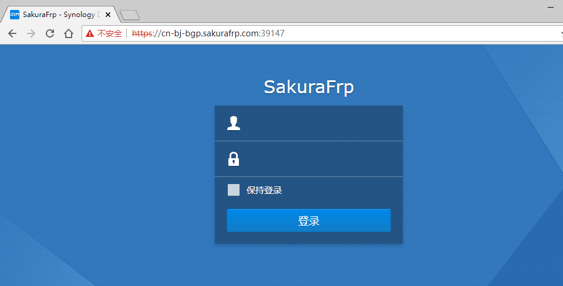

# 群晖(Synology) NAS 穿透指南

群晖 NAS 通常有两种配置方案，即 **直接在系统上安装** 和 **使用 Docker**

本篇教程内容为前者，您也可以选择（可能）更容易配置的 [Docker 教程](/frpc/usage/docker-syno)

## 配置 DSM 面板

?> 您也可以选择穿透 HTTP，但这可能会造成备案/机房屏蔽/ISP屏蔽等问题  
如果您选择穿透 HTTP，出现问题请自行解决

登录 DSM 面板，找到 `连接性->网络->DSM 设置->DSM 端口->HTTPS`，记下这里的端口，后面创建隧道时需要用到


找到 `应用程序->终端机和 SNMP`，确保 SSH 功能已启用并记下这里的 SSH 端口


## 安装 frpc

通过上面提到的 SSH 端口和 DSM 面板的账号、密码登入到 NAS，如果您不知道如何操作请自行百度

接下来，请参考 [Linux 使用教程](/frpc/usage/linux) 中的 **安装 frpc** 一节安装 frpc

注意这里需要采用 `sudo -s` 切换到 `root` 账户，不能使用 `su` 命令，提示输入密码时请输入 DSM 登录密码

## 创建隧道

!> 标有 **拦截 HTTPS** 的节点可能无法正常使用

选择隧道类型为 TCP，填写本地端口为 **0x01** 中记下的 HTTPS 端口，其他设置可以留空


## 配置服务文件

!> 配置服务文件 和 测试服务 部分的教程是为 DSM5/6 准备的，如果您在使用 DSM7，本部分操作您应当参考 [systemd 配置教程](/frpc/service/systemd)；别担心，我们更喜欢 systemd

执行下面的命令编辑配置文件

```bash
# vim /etc/init/frpc.conf
```

?> 如果您按照本文档进行配置并使用了下面的内容，frpc 会在系统启动时自启并在出错时自动重启，无需额外配置

直接写入下面的内容即可，注意把文件中的启动参数换成您的启动参数

```upstart
description "SakuraFrp synology frpc service"

author "FENGberd"

start on syno.network.ready
stop on runlevel [016]

respawn
respawn limit 0 5

exec /usr/local/bin/frpc -f <您的启动参数，如 wdnmdtoken666666:12345>
```

## 测试服务

执行下面的命令测试 frpc 是否能正常运行

```bash
# start frpc
# tail /var/log/upstart/frpc.log
```

如果您看到了图中的两个提示，则 frpc 已安装完毕并可以正常使用了



现在您可以通过 `https://<节点域名>:<远程端口>` 的方式访问 DSM 面板，也可以使用 `https://<日志中标出的连接方式>` 访问，推荐使用节点域名

在本示例中，我使用的是 `https://cn-bj-bgp.sakurafrp.com:39147`


