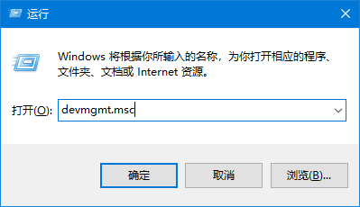
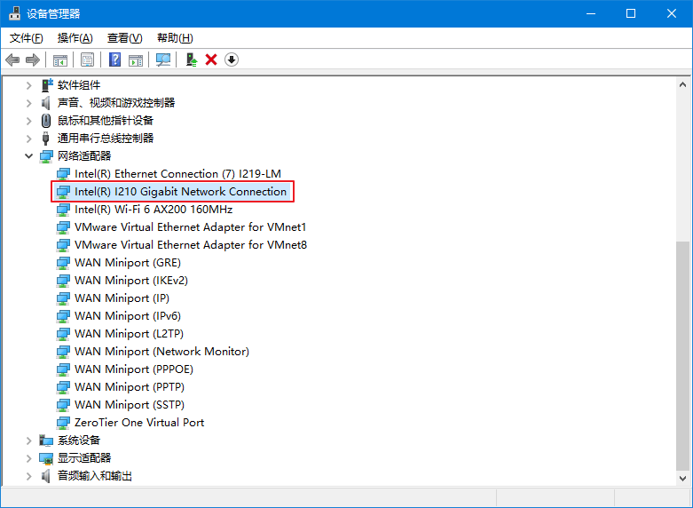
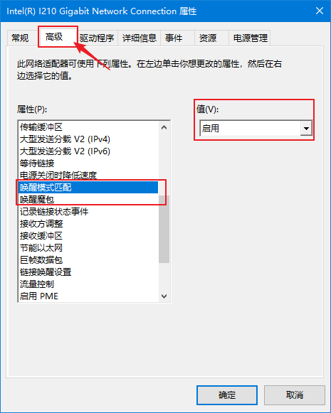
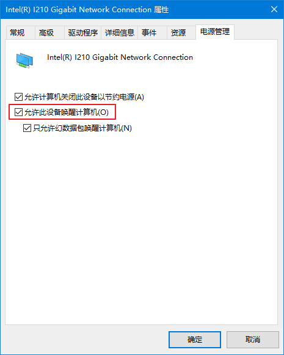
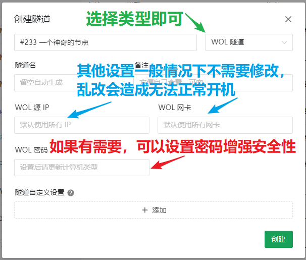
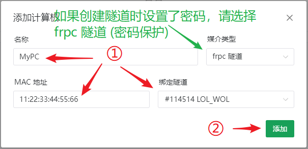
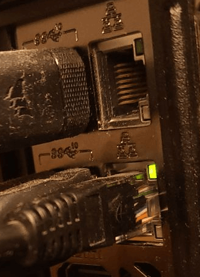

# 远程开机(WOL 网络唤醒) 穿透指南

?> WoL 隧道需要 0.34.2-sakura-3 以上版本的 frpc，该版本与启动器 v2.0.1.2 一起发布

## 配置 WOL 功能

1. 首先到 BIOS 中打开 WOL 相关开关，这一步请自行查看主板 Manual。

   !> 不会查 Manual? 那就百度搜索 "主板产商 网络唤醒" 或者 "笔记本型号 网络唤醒"  
   例: **华硕主板 网络唤醒**，**技嘉主板 网络唤醒**

   通常 WOL 相关设置会有下面的名称：

   - Wake up on LAN
   - Wake-on-LAN from S4/S5
   - Power on by PCIe devices

2. 进入系统，按 Win+R 打开运行，输入 `devmgmt.msc` 打开设备管理器：

   

3. 找到要用作 WOL 的网卡，双击打开网卡配置界面：

   

   !> 不同网卡配置方式可能不一样，如果遇到配置困难请自行百度解决

4. 点击 **高级**，找到 **唤醒模式匹配** 和 **唤醒魔包**，设置为 `启用`：

   

5. 点击 **电源管理**，找到 **允许此设备唤醒计算机**，勾上前面的复选框：

   ?> 下面的 **只允许幻数据包唤醒计算机** 建议也勾上，可以避免部分情况下计算机无故开机

   

6. 如果计算机开启了快速启动，建议参考 [这些资料](https://www.baidu.com/s?ie=UTF-8&wd=%E5%85%B3%E9%97%AD%E5%BF%AB%E9%80%9F%E5%90%AF%E5%8A%A8) 关闭快速启动，否则可能造成无法正常唤醒。

## 创建隧道

创建一条 WOL 隧道，什么都不用填，选择隧道类型就行了。



## 添加计算机

1. 转到 **远程开机** 页面，点击 **添加计算机**：

   

   ?> frpc 将遍历所有网卡并发送 WOL 包，因此此处无需配置网卡名称或 IP

2. 输入计算机的 MAC 地址和任意名称，选择恰当的隧道进行绑定，然后点击 **添加**：

   

## 启动隧道

!> 想一想，关机后隧道还会在线吗? 计算机还能收到服务器下发的开机指令吗?

在同一内网下的 **其他设备** (如路由器) 上启动刚才创建的 WOL 隧道：


## 测试唤醒

**关闭计算机**，点击对应计算机的 **开机** 链接，您会看到 “WOL 请求成功” 的提示，同时计算机应该会正常启动：


## 故障排除

#### 0. 常识问题

- 无线网卡不能远程唤醒，想一想，关机后 WIFI 还连着吗?
- 在 中配置的网卡就是通过 **网线** 直接连接到路由器上那块
- 在 中输入的 MAC 地址要对应 中配置的那块网卡

#### 1. 检查网卡电源状态

**关闭计算机**，查看网线插口上面的 **绿色** 指示灯是否会缓慢闪烁

正常情况下，指示灯应该是这样的:



如果一个指示灯都不亮，网卡电源很可能被切断了

- 如果您在使用 Intel PROSet 网卡，请参考 [这篇博客](https://blog.berd.moe/archives/intel-nuc-i210-wol-troubleshooting/) 尝试通过配置工具解决
- 如果您在使用 PCIe 网卡，请检查 BIOS 中相关的 PCI 电源设置
- 一些很老的主板 + PCIe 网卡可能需要使用三针 WOL 线连接主板，碰到这种情况建议购买新的计算机
- 其他情况请自行百度搜索

#### 2. 检查 frpc 是否正常收到指令并发出唤醒包

点击 **开机** 后，frpc 应该会输出如下日志


如果没有看到相关日志，请检查是否绑定错了 WOL 隧道

#### 3. 检查路由器是否开启了 AP 隔离

部分情况下路由器的 AP 隔离 (或防火墙) 功能会造成唤醒包无法正常被内网其他设备收到，请尝试关闭 AP 隔离或防火墙

## 通过 API 唤醒

您可以在不登录 SakuraFrp 面板的情况下通过 REST API 发起 WOL 唤醒请求。

#### API 端点

向 `https://api.natfrp.com/v1/pc/poweron` 发起 HTTP 请求。

| 请求方式 | 传参方式 |
| --- | --- |
| POST | 支持 `x-www-form-urlencoded` / `multipart/form-data` 类型的请求 |
| GET | 通过查询字符串传参 |

#### API 参数

| 请求参数 | 类型 | 说明 |
| --- | --- | --- |
| `token` | string | 您的访问密钥 |
| `pc` | number | 计算机 ID |

cURL 请求示例：

```bash
curl "https://api.natfrp.com/v1/pc/poweron?token=wdnmdtoken666666&pc=114514"
```

| 返回参数 | 类型 | 说明 |
| --- | --- | --- |
| `success` | boolean | 操作是否成功, 注意 WOL 隧道不在线时此值也为 `true` |
| `message` | string | 提示消息 |

返回示例：

```json
{
   "success": true,
   "message": "WOL 隧道不在线, 开机失败"
}
```

```json
{
   "success": false,
   "message": "请先将计算机绑定到隧道"
}
```
