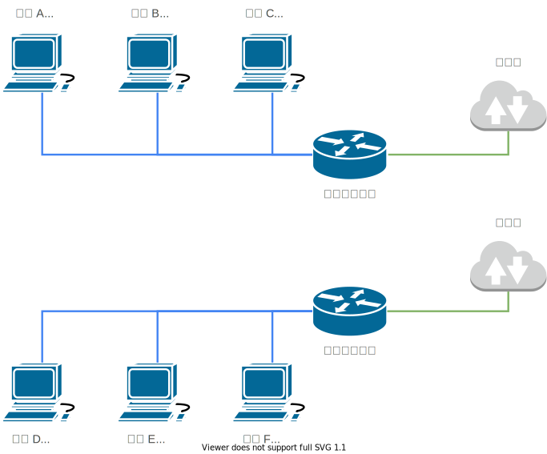
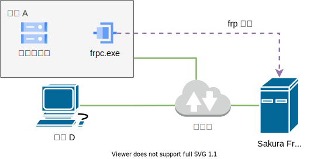
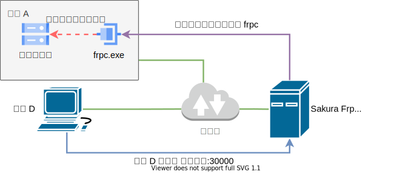

# 内网穿透基础知识

?> 本文为科普性质，我们在编写的时候尽可能避开了路由、NAT 等底层知识，以便 0 基础用户理解。抬杠、抠字眼和喜欢对概念出警的朋友请绕道。

## 什么是内网 :id=what-is-lan

通常情况下，**内网** 可以简单的理解为路由器创建的网络，连接到这个网络的电脑之间可以相互访问。

举个例子，假设我们的网络架构是这样的：

直接通过网线连接到 `小明的路由器` 上的 `电脑 A`、`电脑 B`、`电脑 C` 之间互相访问没有问题，例如：
 - 小明在 `电脑 A` 上启动了游戏服务器，监听端口 `20000`
 - 小明使用 `电脑 B` 打开游戏，连接 `192.168.1.2:20000`
 - `电脑 B` 告诉路由器它想连接 `192.168.1.2` 的 `20000` 端口
 - 路由器知道这个地址对应 `电脑 A`，于是建立 `电脑 B <-> 电脑 A` 的连接，这样小明就成功连上了游戏服务器

同理，连接到 `李华的路由器` 上的几台电脑间相互访问也没有问题。

我们就可以认为小明的路由器下的几台电脑就位于同一个 **内网** 中，而李华的路由器下的几台电脑位于 **另外一个内网** 中。

## 小明和李华相互通信 :id=alice-communicate-with-bob

当小明想和李华通信时，问题就出现了。因为 `小明的路由器` 和 `李华的路由器` 之间没有直接连接，也没有连接到同一个上级路由，它们并不知道如何连接到对方。

### 如果有公网 IP... :id=public-ip-available

假如运营商给 `小明的路由器` 或 `李华的路由器` 分配了公网 IP，这个问题就迎刃而解。

举个例子，假如小明有一个公网 IP `1.1.1.1`，那么李华就可以发起对 `1.1.1.1` 的连接：
 - 我们假设小明已经在路由器上配置了 `10000` 这个端口映射到 `电脑 A` 上的游戏服务器 (`20000` 端口)
 - 李华使用 `电脑 D` 打开游戏，连接 `1.1.1.1:10000`
 - 分配了公网 IP 后，`李华的路由器` 就可以告诉互联网它想连接 `1.1.1.1` 的 `10000` 端口
 - 因为这个公网 IP 分配给了小明，互联网中的路由器就会建立 `李华的路由器 <-> 小明的路由器` 的连接
 - 接下来，`小明的路由器` 会查询之前配置好的端口映射并将这个连接转发到 `电脑 A` 的 `20000` 端口
 - 最终，`电脑 D <-> 小明的路由器:10000 <-> 电脑 A:20000` 的连接

### 如果没有公网 IP 呢? :id=public-ip-not-available

由于 IPv4 地址的稀缺，国内三大运营商（电信、移动、联通）基本都不给家宽用户分配公网 IP，更不用说一些二线小运营商了。

这就导致上面的连接无法成功建立，因为 `李华的路由器` 想连接到 `小明的路由器` 就必须告诉互联网对方的公网 IP，但是现在他们都没有分配到公网 IP。这时，二者想建立连接就需要使用内网穿透或 UDP 打洞等技术了。

### 什么是内网穿透 :id=what-is-lan-reverse-proxy

简单的说，内网穿透就是使用一台有公网 IP 的电脑 （SakuraFrp 将其称为 **节点**） 作为 “中间人” 来与没有公网 IP 的电脑建立连接并转发数据。

 - 首先，我们假设 `电脑 A`、`电脑 D` 和 `穿透节点` 都接入了互联网（绿色实线），但是只有 `穿透节点` 分配到了公网 IP，我们在这里用域名 `idea-leaper-1.natfrp.cloud` 替代。  
   假如小明想让其他人连接 `电脑 A` 上的游戏服务器，他在 `电脑 A` 上开启了 **frpc**，此时 **frpc** 就会通过互联网与穿透节点建立一个连接（紫色虚线），我们将这个连接称为 **隧道**。

   

 - Sakura Frp 节点会给每条 **隧道** 分配一个端口号，也就是所谓的 **远程端口**。这里我们以 `30000` 为例。

 - 现在，李华就可以使用 `电脑 D` 通过互联网连接到 `穿透节点:远程端口` 了，也就是 `idea-leaper-1.natfrp.cloud:30000`（蓝色实线）。  
   连接建立后，`穿透节点` 会通过 **隧道** 联系 frpc，要求 frpc 连接 `本地IP:本地端口`（小明应该配置 `127.0.0.1:10000`），frpc 尝试建立这个连接（红色虚线）

   

 - 如果 frpc 不能成功连接到游戏服务器，就会出现 [无法连接到本地服务](/faq/client-error#connect-to-local-service-error) 的报错。相反，如果连接成功，李华就成功建立了 `电脑 D <-> 穿透节点 <-> 电脑 A (游戏服务器)` 的一条连接

 - 现在，`电脑 D` 向 `电脑 A` 发送数据时，就会先发送到 `穿透节点`，再由 `穿透节点` 转发给 frpc，最后转发给游戏服务器，反之同理（蓝色实线）。

   

   由于 `电脑 D` 并没有直接连接到游戏服务器，而是由 frpc 代为连接，因此游戏服务器看到的 IP 实际上是 frpc 的 IP，也就是 `127.0.0.1`。因此，如果小明想知道 `电脑 D` 的真实 IP，还需要进行 [额外配置](/bestpractice/realip)。
