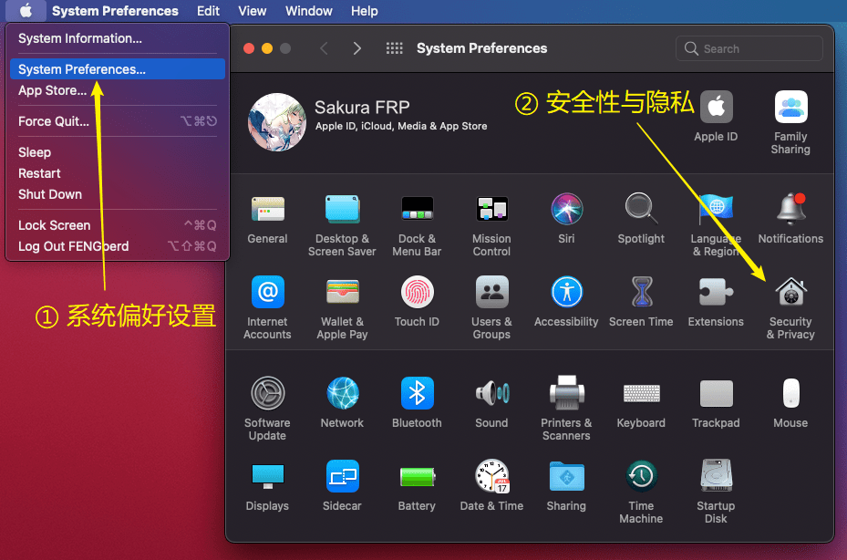
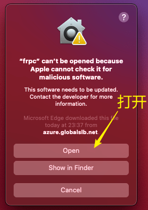

# 常见问题: frpc

## 一个 frpc 可以连接多条隧道吗 {#frpc-connect-to-multiple-tunnels}

自 **v0.42.0-sakura-5** 版本开始，frpc 已支持多节点模式，现在可以连接位于不同节点的多个隧道了。

:::: details 如果您还在使用旧版或原版（无 -sakura- 后缀）的 frpc

::: tip
请注意区别 **进程** 和 **文件**。如果您无法理解这两个概念，可以参考 [进程](https://baike.baidu.com/item/%E8%BF%9B%E7%A8%8B/382503)、[计算机文件](https://baike.baidu.com/item/%E8%AE%A1%E7%AE%97%E6%9C%BA%E6%96%87%E4%BB%B6)
:::

一个 frpc 进程只能连接一个 **节点**，这就是说：

- 如果这几条隧道不在同一个节点，不能，必须开启多个 frpc 进程
- 如果这几条隧道都在同一个节点上，可以在一个 frpc 进程中连接多条隧道。请参阅 [frpc 基本使用指南/从命令行启动隧道](/frpc/usage.md#cli-usage)
- 启动器会自动管理 frpc 进程并且总是确保一个 frpc 连接一条隧道，因此启动器开启的 frpc 无法连接多条隧道

::::

## 如何通过一个 frpc 开启多条隧道 {#multi-tunnels-in-single-frpc}

::: tip
旧版 frpc 只能连接一个 **节点**，但可以开启多条 **隧道**，新版 frpc 无此限制，详见上一条 FAQ
:::

如果您使用 **启动参数** 启动 frpc，只需要在启动参数中加上半角逗号 `,` 分隔的其他隧道 ID 即可，例如：

```bash
frpc -f <访问密钥>:<隧道ID 1>[,隧道ID 2[,隧道ID 3...]]
```

如果您使用 **配置文件** 启动 frpc，可以通过合并配置文件来此目的。但是请注意区分 **所有隧道位于同一节点** 与 **需要连接多个节点** 的情况。

:::: tabs

@tab 隧道位于同一节点

所有隧道位于同一节点时，可以简单的对配置文件进行拼接。假设我们有以下两个配置文件：

<div class="natfrp-side-by-side"><div>

```ini
# 隧道 ALICE 的配置文件
[common]
server_addr = idea-leaper-1.natfrp.cloud
server_port = 7000
// 其余部分省略

[TUNNEL_FOR_ALICE]
type = tcp

local_ip = 127.0.0.1
local_port = 2333
// 其余部分省略
```

</div><div>

```ini
# 隧道 BOB 的配置文件
[common]
server_addr = idea-leaper-1.natfrp.cloud
server_port = 7000
// 其余部分省略

[TUNNEL_FOR_BOB]
type = udp

local_ip = 127.0.0.1
local_port = 179
// 其余部分省略
```

</div></div>

由于两个隧道均位于同一节点，我们可以保留一个 `[common]` 段并将剩余部分合并，得到以下配置文件：

```ini
[common]
server_addr = idea-leaper-1.natfrp.cloud
server_port = 7000
// 其余部分省略

[TUNNEL_FOR_ALICE]
type = tcp

local_ip = 127.0.0.1
local_port = 2333
// 其余部分省略

[TUNNEL_FOR_BOB]
type = udp

local_ip = 127.0.0.1
local_port = 179
// 其余部分省略
```

使用此配置文件启动 frpc，就可以同时连接两条隧道了。

@tab 隧道位于不同节点

::: tip
若合并后配置文件中存在重名隧道，请在隧道名后加上 `@<序号>` 以确保 frpc 能够正常解析  
例如存在两个 `[TUNNEL_NAME]` 段时，将其中一个改为 `[TUNNEL_NAME@1]` 即可避免产生冲突
:::

合并多个节点的配置时操作比较复杂，并且我们需要知道对应的节点 ID，推荐您直接到管理面板勾选所需隧道让系统自动生成配置文件。

假设我们有以下两个配置文件：

<div class="natfrp-side-by-side"><div>

```ini
# 隧道 ALICE 的配置文件
[common]
# 假设此节点的 ID 是 233
server_addr = idea-leaper-1.natfrp.cloud
server_port = 7000
token = SakuraFrpClientToken
// 其余部分省略

[TUNNEL_FOR_ALICE]
type = tcp
local_ip = 127.0.0.1
local_port = 2333
// 其余部分省略
```

</div><div>

```ini
# 隧道 BOB 的配置文件
[common]
# 假设此节点的 ID 是 234
server_addr = idea-leaper-2.natfrp.cloud
server_port = 7000
token = SakuraFrpClientToken
// 其余部分省略

[TUNNEL_FOR_BOB]
type = udp
local_ip = 127.0.0.1
local_port = 179
// 其余部分省略
```

</div></div>

由于两个隧道位于不同，我们需要在 `[common]` 段填写相同的部分，然后以 `[common.<节点ID>]` 的格式增加两个覆写段，并且在隧道段中加上 `node = <节点 ID>` 一项：

```ini
[common]
server_port = 7000
token = SakuraFrpClientToken
# server_addr 不同，因此此处不填写
// 其余部分省略

# 在两个覆写段中写上不同的部分
[common.233]
server_addr = idea-leaper-1.natfrp.cloud

[common.234]
server_addr = idea-leaper-2.natfrp.cloud

[TUNNEL_FOR_ALICE]
# 在此处增加了节点 ID
node = 233

type = tcp
local_ip = 127.0.0.1
local_port = 2333
// 其余部分省略

[TUNNEL_FOR_BOB]
# 在此处增加了节点 ID
node = 234

type = udp
local_ip = 127.0.0.1
local_port = 179
// 其余部分省略
```

使用此配置文件启动 frpc，就可以同时连接位于两个不同节点的隧道了。

::::

## macOS 提示 frpc 无法打开 {#macos-run-frpc-issue}

当您在 macOS 运行 frpc 时，可能会出现下列错误：

  
_“无法打开 “frpc”，因为 Apple 无法检查它是否包含恶意软件。此软件需要更新，请联系开发者了解更多信息。”_

我们推荐您 [通过命令行直接下载和安装 frpc](/frpc/usage.md#macos-install-frpc)，如果您仍想使运行此二进制文件，请参考下面的指南：

1. 转到 `系统偏好设置 > 安全与隐私`：

   

2. 找到 frpc 对应的阻止提示，选择 `仍要打开`，您可能需要输入密码并确认操作：

   

3. 再尝试运行一次 frpc，此时弹出的提示框会有变化。在这个提示框中选择 “打开”，后面就可以正常运行 frpc 了：

   

## ARM 运行提示 Illegal instruction {#arm-illegal-instruction}

首先，请使用下方命令确认您下载的文件 MD5 与软件下载页面显示的 MD5 相同，如果不同可能是文件损坏了：

```bash
md5sum $(which frpc)
```

如果确认文件没有损坏但还是打不开，请 [确认处理器架构](/frpc/usage.md#linux-check-arch)，如果显示为 `armv7l`，请下载 `arm_garbage` 版本重试。

如果上述方法都不行，请 [联系我们](/about.md#contact-us)。

## Windows 系统 frpc 开机自启 {#windows-simple-autostart}

::: warning
注意，此处列出的方法虽然 **【能用】** 但并不能算 **【正确】** 的操作  
使用此方法会产生大量不可控因素或潜在的安全隐患，如果没有特殊需求请 [使用启动器](/launcher/usage.md)
:::

1. 将 `frpc.exe` 放置到 `C:\` 目录下
1. 在 `C:\` 目录下新建一个空白文件，命名为 `frpc.bat`
1. 在 `C:\frpc.bat` 文件中写入以下内容

   ```bat
   C:\frpc.exe -f <您的Token>:<隧道ID>
   ```

1. 以管理员身份运行命令提示符，运行以下命令：

   ```bat
   sc create frpc binPath=C:\frpc.bat start=auto
   ```

1. 重启系统，检查效果
