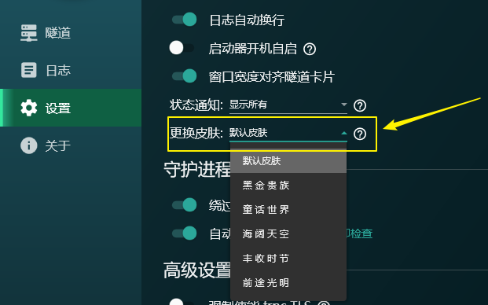

# 常见问题: SakuraFrp 启动器

## 各平台常见问题 {#common}

### unknown status code: 403 / 远程服务器返回错误：（403）已禁止 {#api-error-403}

这通常是由于您的 IP 被 Cloudflare 判定为高危造成的。

请打开此网页检查您的 Cloudflare 威胁指数：[cf.qn.md](https://cf.qn.md/)

通常情况下，您的 IP 威胁指数应该是 0。超过 0 的指数都可能碰到此错误。

如果威胁指数超过 0，建议您更换 IP（重启光猫和路由器）或是尝试使用手机热点进行操作。

### 怎么关闭自动更新功能 {#disable-update}

直接关闭 **设置** 标签中的 **自动更新** 开关即可，关闭后启动器不会进行任何更新检查或下载。

## Windows 常见问题 {#windows}

### 守护进程异常退出 {#daemon-fault}

请在错误信息中寻找下列关键词，点击展开对应章节：

::: details 启动器文件损坏

这通常是用于杀毒软件误伤启动器组件（特别是 `frpc.exe`），请：

1. 点击 **中止** 按钮退出用户界面
1. 参考 [这篇文档](/launcher/antivirus.md) 在杀软中添加白名单
1. 重新下载安装包覆盖安装启动器
1. 重新打开启动器

:::

::: details 文件签名验证失败

这很可能意味着您的电脑可能已经被病毒感染，请：

1. 点击 **中止** 按钮退出用户界面
1. 卸载启动器，清除可能被感染的文件
1. 使用正规杀毒软件进行全盘杀毒
1. 重新下载安装包进行安装

:::

::: details singleton check failed, do not start duplicate process

如果您没有进行过高级配置，这通常是由于自动更新卡住了，请：

1. 同时按下 `Ctrl-Shift-Esc` 组合键打开任务管理器
1. 找到并结束 `SakuraFrpService.exe`
1. 如果您安装更新后看到此错误，再找到并结束 `update.exe`
1. 点击 **重试** 按钮或重启一下用户界面

:::

::: details failed to load config

这通常是由于配置文件损坏，如果您的电脑最近出现过蓝屏、死机、异常断电就可能碰到此错误。请：

1. 同时按下 `Win-R` 组合键打开运行窗口
1. 输入 `%ProgramData%\SakuraFrpService` 并回车打开配置文件夹
1. 删除 `config.json` 文件
1. 点击 **重试** 按钮或重启一下用户界面

:::

### 守护进程启动失败 {#daemon-launch-failed}

请在错误信息中寻找下列关键词，点击展开对应章节：

::: details 无法启动计算机 "." 上的服务，服务没有及时响应启动或控制请求

这通常是由于守护进程报错退出，在系统服务模式下我们无法获取到具体的错误信息。

- 先点击 **忽略** 按钮抑制提示
- 在高级设置中点击 **卸载服务**
- 然后参考 [守护进程异常退出](#daemon-fault) 一节进行排查

:::

### 系统服务状态异常, 启动器可能无法正常运行 {#service-abnormal}

- 点击 **卸载服务** 并等待卸载完成
- 随后重新点击 **安装服务** 进行安装

### 未连接到守护进程, 大部分功能将不可用, 请尝试重启启动器 {#service-disconnected}

:::: details 如果您使用的是 Windows 7 与早期 3.0 版启动器，点击此处

这是一个已知 BUG，我们已在核心服务 **3.0.5** 中修复此问题（发布于 **2023-08-16**）。

请重新下载启动器安装包，确认安装包 MD5 与网站上发布的一致（避免下载到缓存的旧版），然后覆盖安装。

临时缓解措施：

1. 打开启动器，看到 "未连接到守护进程" 提示后稍等几秒
1. 在任务栏找到启动器图标，右键并点击 **退出启动器**

   ::: warning
   **不要** 使用 **彻底退出** 按钮，该缓解措施的原理就是让启动器 UI 重新连接，点 **彻底退出** 就没有意义了
   :::

1. 再次打开启动器，现在应该能正常使用了
1. 每次重启核心服务（比如重启电脑后）都需要重复上述操作，建议在有条件的情况下尽快更新到最新版

::::

请按顺序尝试以下操作:

1. 重新安装启动器
1. 右键启动器，选择 **以管理员身份运行**
1. 点击 **卸载服务** 并重启启动器（如果需要使用系统服务，稍后再点安装）
1. 若问题持续存在，可以加入官方反馈群联系管理员

### 如何自定义安装路径 {#installation-path}

默认安装路径为 `C:\Program Files\SakuraFrpLauncher`，这通常能满足绝大多数用户的需求。

部分启动器功能需要注册系统服务才能正常工作，为了避免这些功能故障，GUI 不提供自定义安装路径的选项。

如您确有特殊需要，请参阅 [Inno Setup 文档](https://jrsoftware.org/ishelp/index.php?topic=setupcmdline) 传入恰当的命令行参数（`/DIR`）来设置安装路径。

::: warning 注意
安装路径必须以 `SakuraFrpLauncher` 结尾来建立单独的文件夹，以免卸载时误删其他文件
:::

```sh
# 例如安装到 D:\MyFolder\SakuraFrpLauncher
SakuraLauncher.exe /DIR="D:\MyFolder\SakuraFrpLauncher"
```

### 下载附加文件时出错 {#error-on-download-extra-files}

如果在 **正在下载附加文件...** 时报错 **Server Certificate Invalid or not present**，请按顺序操作:

1. 检查系统时间是否正确，然后重试
1. 点击 [这里](https://dotnet.microsoft.com/zh-cn/download/dotnet-framework/net48)，然后点击 **下载 .NET Framework 4.8 运行时** 下载框架安装程序
1. 关闭启动器安装程序，运行刚才下载的框架安装程序，安装框架
1. 重新运行启动器安装程序，正常进行安装

### 这个程序需要 Windows 服务包 1 或更高 {#requires-sp1}

出现此提示说明系统版本过旧，Windows 7 用户必须更新到 Service Pack 1 或以上才可以正常使用。

我们推荐您更新到最新版 Windows 10 (或者 11) 来获取更好的使用体验，关于兼容性问题请参阅 [启动器系统需求](#system-requirement)。

### 启动器系统需求 {#system-requirement}

| 硬件 | 最低需求 | 推荐配置 |
| --- | --- | --- |
| CPU | 1 GHz | 2.3 GHz, 4 线程或更高 |
| RAM | 700 MiB | 4 GiB 或更高 |
| 硬盘剩余空间 | 50 MiB | 2 GiB 或更高 |

| 操作系统 | 兼容性 |
| --- | --- |
| Windows 11 | 直接安装启动器即可使用 |
| Windows 10, 1903 及以上 | 直接安装启动器即可使用 |
| Windows 10, 1607~1809 | 需额外安装 .NET Framework 4.8 |
| Windows 10, 1511 及以下 | 不兼容 |
| Windows 8.1 | 需额外安装 .NET Framework 4.8 |
| Windows 8 | 不兼容 |
| Windows 7 SP1 | 需额外安装 .NET Framework 4.8 |
| Windows 7 | 不兼容 |
| Windows Vista SP2 | 不兼容 |
| Windows Vista SP1 | 不兼容 |
| Windows Vista | 不兼容 |
| Windows XP | 不兼容 |

### 该软件需要安装 .NET Framework 4.0 及以上 {#dotnet-required}

出现 `该软件需要安装 .NET Framework 4.0 及以上` 类似提示。

- 安装 `.NET Framework 4.8` 即可 ([点击前往微软官方下载页面](https://dotnet.microsoft.com/download/dotnet-framework/net48))。

### 隧道启动失败: 拒绝访问 / 系统找不到指定的文件 / file does not exist

这种情况通常是杀毒软件误杀了 frpc 造成的，请：

1. 参考 [这篇文档](/launcher/antivirus.md) 在杀软中添加白名单
1. 重新下载安装包覆盖安装启动器
1. 重新打开启动器

### 杀毒软件提示启动器有病毒怎么办 {#misc}

请检查杀毒软件提示的具体病毒名称，如果是 `PUA`、`Not-A-Virus`、`Riskware` 等类别，通常都是对 `frpc.exe` 的误报。

您可以校验启动器安装程序的 MD5 是否与我们网站上发布的 MD5 值相匹配，如果这个值不匹配可能说明您下载到的安装程序被病毒感染了。

如果这个 MD5 值是匹配的，建议您参考 [这篇文档](/launcher/antivirus.md) 在杀软中添加白名单然后重新安装启动器。

### 点击 创建隧道/加号 按钮后闪退

该问题应该不会在 3.0 及以上版本的启动器中出现。

出现此问题说明您的系统中存在一些有问题软件塞满了系统的临时文件夹后没有及时释放。

一般出现此问题时，会伴随出现系统不稳定、其他软件假死、闪退等问题。

请在 文件资源管理器 的地址栏中输入 `%TEMP%` 并回车进入临时文件夹，删除其中较旧的文件即可。

### 怎么更换启动器主界面显示的图标 {#change-icon}

快速点击图标，只要您手速够快就可以更换图标。我们有三个图标供您选择。

如果想换回来，退出启动器并修改 `%localappdata%/SakuraLauncher/<Hash>/<版本号>/user.config` 中 `LogoIndex` 项对应的值为 `0` 即可。

### 怎么更换启动器主题皮肤 (主题) {#change-theme}

如果您在使用 **v2.0.4.0** 及以上版本启动器，前往设置页面更换皮肤即可。更换后需要重启启动器才能生效。



如果您在使用旧版本启动器，关闭启动器，修改 `%localappdata%/SakuraLauncher/<Hash>/<版本号>/user.config` 中 `Theme` 项对应的值:

| Theme | 主题名称 |
| --- | --- |
| 0 | 默认主题 |
| 1 | <b style="color: #be853d">黑 金 贵 族</b> |
| 2 | <b style="color: #584572">童 话 世 界</b> |
| 3 | <b style="color: #3f689e">海 阔 天 空</b> |
| 4 | <b style="color: #92513d">丰 收 时 节</b> |
| 5 | <b style="color: #529a82">前 途 光 明</b> |

修改完毕后重新打开启动器即可。

## Linux 常见问题 {#linux}

### 登出后隧道断开、启动器退出 {#linux-logout-disconnect}

如果您使用 Systemd 配置了用户服务，这通常是由于用户服务在会话结束后被关闭造成的。

您可以考虑下列方案之一：

- 使用 `loginctl enable-linger` 命令来启用 lingering
- 将启动器配置为 Systemd 系统服务。

  如果您之前配置了用户服务，记得删除相关文件（文档示例为 `~/.config/systemd/user/natfrp.service`）。
  
  下面提供了一个简单的系统服务例子，将其放到 `/etc/systemd/system/natfrp.service` 中即可，记得修改用户名：

  ```systemd
  [Unit]
  Description=SakuraFrp Launcher
  After=network.target

  [Service]
  # 在后面加上您的用户名，例如（这里的 alice 只是举个例子，请写实际的用户名）:
  # User=alice
  # Group=alice
  User=
  Group=

  Type=simple
  TimeoutStopSec=20

  Restart=always
  RestartSec=5s

  # 在这里填写启动器的绝对路径和 --daemon 选项，例如：
  # ExecStart=/home/alice/.config/natfrp/natfrp-service --daemon
  ExecStart=

  [Install]
  WantedBy=multi-user.target
  ```
