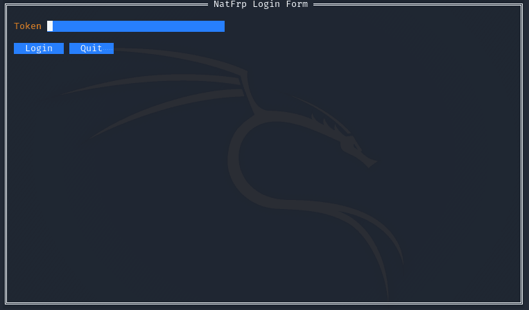
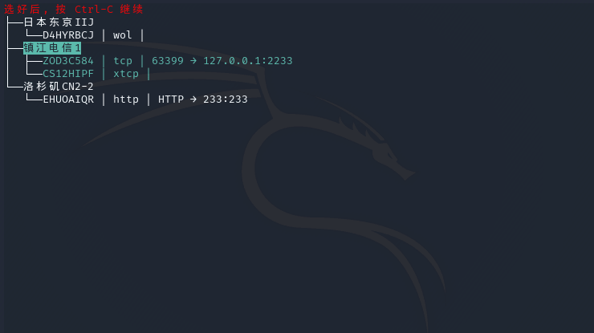

# frpc 用户手册

下面是写给普通用户的一般使用教程，如果您是高级用户，请参阅 [此章节](#advanced) 获取更多信息。

## 从 TUI 启动隧道 :id=tui-usage

在 `frpc.ini` 不存在的情况下，不带参数直接运行 frpc 会出现一个交互式 UI。

输入 **访问密钥**，然后使用 `Tab` 键切换到 **Login** 按钮并按 `回车` 键登录 (若终端支持也可使用鼠标进行操作)：



登录成功后 TUI 会显示当前账户下的隧道列表，使用方向键选中想要启动的隧道，按空格标为绿色 (或使用鼠标直接点击隧道)：

?> 可以一次性启用多个隧道，但是这些隧道必须位于同一节点下  
您也可以直接选中节点来启用该节点下的所有隧道



选择完毕后，按 `Ctrl-C` 即可启动隧道，相关启动参数会被保存到配置文件 `frpc.ini` 中，下次不带参数直接运行 frpc 时不再显示 TUI 而是直接启动隧道：

?> 自 `v0.42.0-sakura-3` 版本起，启动时若不带参数 且 `frpc.ini` 存在，您会看到 `正在使用配置文件运行，在 3 秒内按任意键进入配置模式` 的提示。按下任意按键即可进入配置界面，否则 frpc 会自动加载 `frpc.ini` 并启动里面保存的隧道


## 从命令行启动隧道 :id=cli-usage

### 启动参数格式 :id=startup-parameter

!> 如果您没有按照 [frpc 基本使用指南](/frpc/usage) 安装 frpc，或您使用的是 Windows 系统，启动时要把 "frpc" 换成下载到的的文件名  
如 `frpc_windows_386.exe` 、 `./frpc_linux_amd64` 等

frpc 支持启动单条、多条或位于某个节点上的所有隧道。同时启动多条隧道时，这些隧道必须位于同一节点。

 - `frpc -f <访问密钥>:<隧道ID>[,隧道ID[,隧道ID...]]`
 - `frpc -f <访问密钥>:n<节点ID>`
 - 示例：
   - `frpc -f wdnmdtoken6666666:1234`
   - `frpc -f wdnmdtoken6666666:1234,6666,7777,114514`
   - `frpc -f wdnmdtoken6666666:n95`

### 使用举例 :id=cli-example

假设您的 Token 为 `wdnmdtoken6666666`


您的隧道列表如下图所示


假设当前运行的系统为 32 位的 Windows 系统，因此您下载到的 frpc 文件名是 `frpc_windows_386.exe` 。

1. 启动图中的第一条隧道：
```cmd
frpc_windows_386.exe -f wdnmdtoken666666:114514
```

1. 启动 **#29 圣何塞CUVIP** 节点下的所有隧道，可以不输入隧道 ID：
```cmd
frpc_windows_386.exe -f wdnmdtoken666666:n29
```

1. 第二条命令也可以替换为手动输入两个隧道 ID，效果是相同的：
```cmd
frpc_windows_386.exe -f wdnmdtoken666666:114514,114515
```

---

## 高级用户手册 :id=advanced

由 Sakura Frp 分发的 frpc 与上游开源版本有一定差异，此处仅列出我们新增的功能。如果您在寻找上游 frp 的启动参数、配置文件选项等，请参阅 [上游文档](https://gofrp.org/docs/ ':target=_blank')。

我们总是推荐（并假设）您使用最新版客户端，因此文档中列出的特性不会专门标注可用的版本。如果您需要使用旧版并了解该版本对应的特性，建议您参考 [Nyatwork Static CDN](https://nyat-static.globalslb.net/natfrp/client/) 中的文件修改时间并对照文档的 Commit History 作出判断。

### 新增命令行开关 :id=advanced-switches

| 开关 | 说明 |
| --- | --- |
| -f, --fetch_config | 从 Sakura Frp 服务器自动拉取配置文件<br>- 参数 1: `<Token>:<TunnelID>[,<TunnelID>...]`<br>- 参数 2: `<Token>:n<NodeID>` |
| -w, --write_config | 拉取配置文件成功后将配置文件写入 `./frpc.ini` 中 |
| -n, --no_check_update | 启动时不检查更新 |
| -V, --version_full | 显示完整版本号并退出 frpc |
| --remote_control `<密码>` | 配置远程管理 E2E 密码，请参阅 [frpc 远程管理](/frpc/remote) 获取更多信息 |
| --update | 进行自动更新，如果不设置该选项默认只进行更新检查而不自动更新 |
| --natfrp_tls | 全程使用 TLS 加密流量，将有效增大 CPU 占用并显著提高延迟<br>_* 上面没写错，这是一个内部开关，我们不建议您使用它_ |
| --report | 向启动器上报信息<br>_* 这是一个内部开关，我们不建议您使用它_ |
| --watch `<PID>` | 监控指定 PID 并在进程退出时退出 frpc，同时禁用日志颜色输出<br>_* 这是一个内部开关，我们不建议您使用它_ |

### 新增环境变量选项 :id=advanced-env

自 `v0.39.1-sakura-1.1` 版本起，您可以用环境变量代替 `-f` 开关。

| 变量名 | 说明 | 举例 |
| --- | --- | --- |
| NATFRP_TOKEN | 访问密钥 | wdnmdtoken666666 |
| NATFRP_TARGET | `隧道 ID 列表` 或 `n<节点 ID>` | 1234,6666,7777 |

### 新增配置文件选项 :id=advanced-config

#### common 段 :id=common

| 选项 | 类型 | 默认值 | 说明 |
| --- | --- | --- | --- |
| sakura_mode | Boolean | false | 启用 Sakura Frp 自有的各类 frpc 特性<br>下方提到的绝大多数选项均依赖于此项 |
| use_recover | Boolean | false | 启用不断线重连功能 |
| persist_runid | Boolean | true | 根据本机特征 & 隧道信息生成唯一 RunID 以便快速重连 |
| remote_control | String | 空 | 配置远程管理 E2E 密码，留空则禁用远程管理<br>请参阅 [frpc 远程管理](/frpc/remote) 获取更多信息 |
| dynamic_key | Boolean | true | 启用 DKC，即使用 SM2 和 AES-128-GCM / AES-128-CFB 加密控制连接和数据连接（如果启用） |

#### TCP 隧道 :id=tcp_proxy

| 选项 | 类型 | 默认值 | 说明 |
| --- | --- | --- | --- |
| concat_packet | Int | -1 | 配置合并封包功能的最小字节数，有助于减少小包并降低网卡 PPS<br>设置为 `-1` 禁用合并封包功能 |
| auto_https | String | 空 | 配置自动 HTTPS 功能<br>请参阅 [配置 frpc 的自动 HTTPS 功能](/faq/site-inaccessible#frpc-auto-https) 获取更多信息 |
| auto_https_mode | String | 空 | 配置自动 HTTPS 的工作模式<br>- 留空 **[默认值]**: 自动探测是否为 HTTP 服务并选择恰当的工作模式<br>- `http`: 使用 HTTP 服务器进行反代并在发给本地服务的请求中追加 `X-Forwarded-For` 请求头<br>- `passthrough`: 直通模式，单纯的在 TCP 流外面套上一层 TLS，不对数据包进行其他修改操作 |
| auth_pass | String | 空 | 配置访问认证功能的密码，留空则禁用密码认证<br>请参阅 [安全指南-frpc 访问认证](/bestpractice/security#frpc-访问认证) 获取更多信息 |
| auth_totp | String | 空 | 配置访问认证的 TOTP 功能，留空则禁用 TOTP 认证<br>- 留空 **[默认值]**: 不启用 TOTP 验证<br>- Base32 种子: 使用默认配置启用 TOTP<br>- TOTP URI: 使用自定义配置启用 TOTP, 可选参数有 `digits`、`skew`、`algorithm`<br>&nbsp;&nbsp;_例: `otpauth://totp/auto?secret=<种子>&digits=<数字>&skew=<周期>&algorithm=<算法>`_<br>&nbsp;&nbsp;_* algorithm 参数取值为 `md5`、`sha1` (默认)、`sha256`、`sha512`_<br>_* frpc v0.42.0-sakura-3 及以上版本可用_ |
| auth_time | String | 2h | 配置访问认证功能在没有勾选「记住」时授权过期时间<br>接受的后缀为 `h`/`m`/`s`，请从大到小排列，如 `1h3m10s` |
| auth_mode | String | online | 配置 SakuraFrp 访问认证功能的认证模式<br>- `online`: 允许通过密码认证或通过 SakuraFrp 面板进行授权<br>- `standalone`: 仅允许通过密码认证, 忽略 frps 下发的 IP 授权信息<br>- `server`: 不启用密码，只能通过 SakuraFrp 面板进行授权 |
| auth_redirect | String | 空 | 配置 SakuraFrp 访问认证通过后自动跳转 (或打开) 到的页面 |

?> 在强制访问认证的节点上未设置访问密码（即未启用访问认证）时，将强制打开访问认证，使用 `server` 模式，您将需要在用户面板进行授权

#### HTTPS 隧道 :id=https_proxy

| 选项 | 类型 | 默认值 | 说明 |
| --- | --- | --- | --- |
| force_https | Int | 0 | 配置 frps 自动重定向 HTTP 请求到 HTTPS 的功能，有助于减少隧道占用。<br>- `0`: 禁用自动重定向功能<br>- 其他数字: 启用重定向功能并在重定向时返回该数字作为状态码，推荐使用 `301` 或 `302`<br>_* 设置为 301 时，返回的 Location 头只包含 Host 和 Path，Query 及后面的部分会被丢弃_ |
| auto_https | String | 空 | 与 [TCP 隧道](#tcp_proxy) 中同名选项相同 |
| auto_https_mode | String | 空 | 与 [TCP 隧道](#tcp_proxy) 中同名选项相同 |

#### WOL 隧道 :id=wol_proxy

| 选项 | 类型 | 默认值 | 说明 |
| --- | --- | --- | --- |
| password | String | 空 | 指定防止未授权 WOL 访问的密码，尚未在管理面板实装相关 UI |
| from_ip | String | 空 | 指定 WOL 发送时使用的源 IP |
| from_if | String | 空 | 指定 WOL 发送时使用的网卡 |

## 部分 frpc 新增特性 :id=advanced-feature

1. 日志输出会对用户 Token 进行打码，防止 Token 泄漏
1. 连接成功后会输出一段提示信息，提示用户当前隧道的连接方式
   - 该提示信息不会匹配日志格式。目的是兼容旧版启动器对旧版本 frpc 日志解析的逻辑
1. 与服务器连接断开后会尝试自动进行重连，客户端将尝试直接恢复 MUX 连接，因此短暂的断线 (10 秒内) 能实现用户无感知重连
1. 根据本机特征 & 隧道信息生成 `RunID`
   - 这有助于服务端快速辨识掉线的 `frpc` 并进行重连作业。生成的 `RunID` 为一串 `Hash`，不会包含敏感信息
1. 启动时会从 API 服务器的 `/client/get_version` 获取最新版本信息, 并提示用户进行更新或进行自动更新
1. 内建 TUI，方便用户在无参数启动时进行配置
1. 增加封包合并功能以减少小包
1. 下发客户端限速，提升连接体验并有助于解决部分应用断线问题
   - 服务端读取限速存在上行速度在 **跑满本地带宽** 和 **0 Byte/s** 之间反复跳动的问题，在客户端也进行限制即可获得稳定的最大速度
1. 增加自动 TLS 配置功能以简化通过 TCP 隧道调试 HTTP 应用的配置流程
1. 增加自动 HTTPS 重定向功能以减少隧道占用
1. 增加访问认证功能以提升隧道安全性
