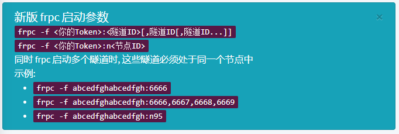
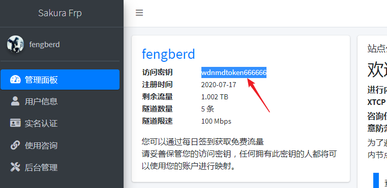

# frpc 用户手册

Sakura Frp 对 frpc 进行了一些修改, 下面是我们的 frpc 用户手册, 高级用户请直接查看 [此章节](#高级用户).

## 普通用户

查看隧道列表页面我们可以看到:

这里面的 frpc 在启动的时候要换成你实际下载的文件名, 比如 frpc_windows_386.exe 或者 frpc_linux_amd64 之类的.

举个例子, 比如我的 Token 是 wdnmd6666666:

然后我的隧道列表是这样的:

那么假如我现在是 Windows 32位系统, 下载的 frpc 文件名是 `frpc_windows_386.exe`

 - 启动图里的第一条隧道, 就可以执行 `frpc_windows_386.exe -f wdnmdtoken666666:85823`
 - 启动镇江双线这个节点下的所有隧道, 我就可以不输隧道 ID, 执行 `frpc_windows_386.exe -f wdnmdtoken666666:n6`
 - 当然, 上面的指令也可以换成手动输两个隧道 ID, 执行 `frpc_windows_386.exe -f wdnmdtoken666666:85823,94617` 效果是一样的

## 高级用户

下面的文档详细解释了 Sakura Frp 提供的 frpc 与原开源版本的差异

#### 新增的启动参数: 

 - `-f, --fetch_config` 从 Sakura Frp 服务器自动拉取配置文件
   - 参数列表1: `<Token>:<TunnelID>[,<TunnelID>[,<TunnelID>...]]`
   - 参数列表2: `<Token>:n<NodeID>`
 - `-w, --write_config` 拉取配置文件成功后将配置文件写入 `./frpc.ini` 中
 - `--update` 进行自动更新, 如果不设置该选项默认只进行更新检查而不自动更新
 - `-n, --no_check_update` 启动时不检查更新

#### 新增的配置文件选项:

 - `sakura_mode = <Boolean>` 该选项用于启用 Sakura Frp 自有的各类特性, 设置为 `false` 将 __禁用所有__ Sakura Frp 相关特性, 默认值为 `false`
 - `use_recover = <Boolean>` 该选项用于启用重连功能, 默认值为 `false`
 - `persist_runid = <Boolean>` 该选项启用后 RunID 将不再从服务器拉取而是根据本机特征 & 隧道信息生成, 默认值为 `true`

#### 新增的特性:

 - frpc 的日志输出会对用户 Token 进行打码, 防止 Token 泄漏
 - frpc 连接成功后会输出一段提示信息, 提示用户当前隧道的连接方式. 该提示信息不会匹配日志格式, 目的是兼容启动器对旧版本 frpc 日志解析的逻辑.
 - frpc 与服务器连接断开后会尝试自动进行重连, 客户端将尝试直接恢复 MUX 连接, 因此短暂的断线 (10秒内) 能实现用户无感知重连
 - frpc 将根据本机特征 & 隧道信息生成 RunID, 这有助于服务端快速辨识掉线的 frpc 并进行重连作业. 生成的 RunID 为一串 Hash, 不会包含敏感信息
 - frpc 启动时会从 API 服务器的 /client/get_version 获取最新版本信息, 并提示用户进行更新或进行自动更新
 - frps ~~数据删除~~
 - frps ~~数据删除~~
 - frps ~~数据删除~~
 - frps ~~数据删除~~
