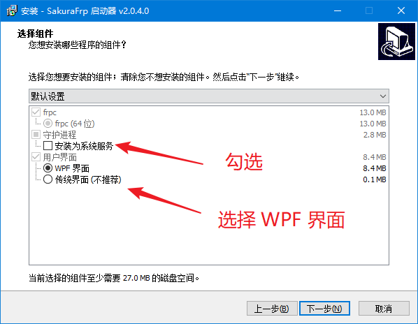

# 系统服务

SakuraFrp Launcher v2.0.0.0 后提供了切换运行模式的选项，您可以将守护进程作为系统服务运行，从而实现开机无需进入桌面即自启动 frpc 的效果

!> 仅WPF启动器支持切换运行模式，传统启动器不提供相关配置 UI，只能使用守护进程模式

### 前置知识

启动器和守护进程的区别:

 - 守护进程: 负责用户登录，管理所有 frpc 的运行，与 SakuraFrp 服务通信等，基本上所有功能都是它实现的  
   对应文件 `SakuraFrpService.exe`
 - 启动器: 给您提供一个控制守护进程的界面  
   对应文件 `SakuraLauncher.exe` 或 `LegacyLauncher.exe`

两种运行模式的区别:

 - 守护进程: 守护进程就是守护进程，没有特别的权限，完全由启动器管理  
   该模式下开机自启功能受限，必须进入桌面才会启动隧道
 - 系统服务: 将守护进程安装为一个 [Windows 系统服务](https://baike.baidu.com/item/%E7%B3%BB%E7%BB%9F%E6%9C%8D%E5%8A%A1)，同时由 Windows 系统和启动器管理  
   该模式下 Windows 开机时就会启动守护进程，无需进入桌面就能自启各个隧道，__可满足重启后通过 frp 连接远程桌面等需求__

### 安装服务

首先，点击退出登录，然后右键启动器托盘点击 __彻底退出__ 来结束启动器

确认启动器退出完毕后，将整个启动器文件夹挪到一个固定的位置，具体的位置可以自行决定，在此示例中我移动到了 `C:\SakuraLauncher`

!> 安装服务后移动或删除此文件夹前必须卸载服务并彻底退出启动器，否则可能会造成系统不稳定

顺便一提，安装服务后更新时建议使用自动更新，如果需要手动更新请参考下图覆盖文件

一切准备完毕后，打开启动器，点击 __安装服务__ ，阅读说明后点确认继续操作

随后系统会弹出 UAC 提示框，点击 __是__

如果一切正常，服务安装成功后启动器会自动退出，随后再打开启动器正常登录即可使用

?> 运行模式显示为 __系统服务__ 后，__不需要__ 打开 `启动器开机自启` 这个开关，开机时服务会自动启动

__如果您是高级用户__ ，您可以在 `services.msc` 中找到 `SakuraFrp Daemon Sevice` 并对其进行自定义配置，普通用户不需要进行此操作

### 卸载服务

!> 服务卸载可能需要数十秒时间，请耐心等待，不要强制关闭启动器，否则可能产生不可预料的后果

卸载流程和安装流程基本一模一样，请参阅上面的安装说明
