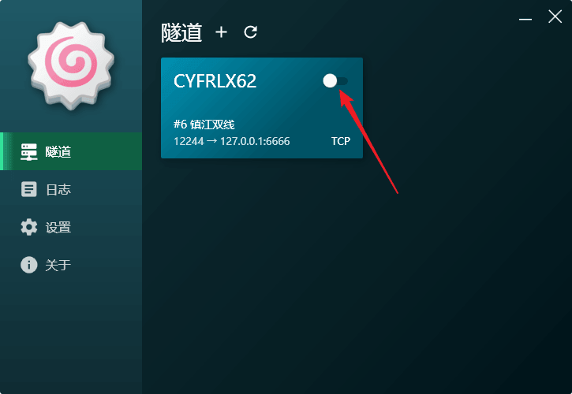
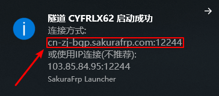

# 启动器使用教程

## 安装启动器

### 如果看不懂文字版可以看一分钟视频安装教程

*注: 视频教程跳过了很多东西，不推荐阅读理解能力没有问题的用户观看*

<b style="font-size: 20px">Windows 7 安装运行库 (点击展开)</b>

[filename](_videos/install-win7-runtime.mp4 ':include :type=video')

 

<b style="font-size: 20px">Windows 10 安装启动器并登录 (点击展开)</b>

[filename](_videos/install-win10.mp4 ':include :type=video')

### 图文安装教程

登录管理面板，在侧边栏点击 **软件下载**:

!> 我们不提供自定义安装路径的选项，如有此类需求请自行编译启动器  
默认安装路径为 `C:\Program Files\SakuraFrpLauncher`

点击启动器右侧的下载地址来下载启动器安装程序:

下载完毕后双击安装程序并根据向导提示进行安装:

?> 正常情况下，安装程序会自动下载系统中缺失的运行库  
如果下载失败，请到 [这里](https://dotnet.microsoft.com/download/dotnet-framework/net48 ':target=_blank') 下载 `.NET Framework 4.8 Runtime`  
并到 [这里](https://support.microsoft.com/zh-cn/help/2977003/the-latest-supported-visual-c-downloads ':target=_blank') 下载 `Visual Studio C++ 2015、2017 和 2019 (x86)`  
手动安装这两个运行库，随后重新运行启动器安装程序即可

## 登录启动器

?> 传统启动器和新版 (WPF) 启动器使用方法基本一致，此处仅提供新版启动器的教程

安装完毕后双击桌面图标 (如果您选择了 `创建桌面快捷方式`) 来运行启动器。

?> 如果您没有勾选 `创建桌面快捷方式`，请打开 `C:\Program Files\SakuraFrpLauncher` 文件夹  
然后运行 `SakuraLauncher.exe`  (如果安装的是传统启动器，请运行 `LegacyLauncher.exe`)  

进入 [用户信息](https://www.natfrp.com/user/profile ':target=_blank') 页面，复制 **访问密钥** 到启动器，点击登录

## 创建隧道

登录成功后会自动切换到 **隧道** 标签，点击加号新建隧道

接下来选择您要映射的服务，本文以映射 `iperf3` 服务器为例，直接找到进程 `iperf3` 点击，然后选择一个服务器，最后点创建即可

创建成功后按需要选择是否继续创建

## 启用隧道

!> 不要频繁开关隧道，启用隧道后稍等一会才能连接成功  
如果长时间 (超过一分钟) 没看到连接成功的提示框请检查日志

在隧道标签中找到您要启用的隧道，点击右上方开关启用

启动成功后右下角会弹出通知，提示隧道连接方式。该通知可以在设置中通过 `关闭隧道状态提示` 选项禁用

转到日志标签可以复制连接方式

这样我们的服务就可以在外网被访问到了

## 删除隧道

将鼠标放到隧道卡片上悬停一会，卡片右上角会出现删除按钮

点击删除按钮，然后确认操作即可删除隧道

## 开机启动

`2.0.0.0` 及以上版本的启动器提供两种开机启动方式，一般情况下直接勾选下图中的选项就能满足使用需求

如需不进桌面自启 (如穿透远程桌面服务)，请参阅 [系统服务](/launcher/service) 页面了解服务启动方式

