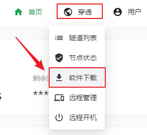
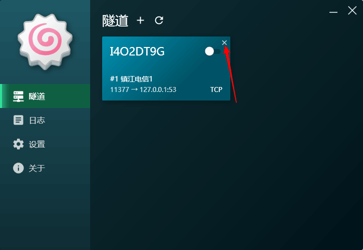

# 启动器基本使用教程

?> 传统启动器和新版 (WPF) 启动器使用方法基本一致，此处仅提供新版启动器的教程

### 下载软件

?> 启动器需要安装 `.NET Framework 4.5` 或以上版本才能正常运行  
Windows 10 已内置此框架，不需要单独下载，旧版本系统 (Windows 7) [点击前往微软官方下载页面](https://dotnet.microsoft.com/download/dotnet-framework/net45)

登录管理面板，在侧边栏点击 “软件下载” :

然后点击对应版本的下载地址来下载启动器，建议下载上面的 **推荐** 版本，如果打不开再换下面的传统启动器

下载完毕后 __不要直接运行__ ，解压到一个单独的文件夹，比如我这里解压到 `R:\`

### 登录启动器

找到刚才解压出的文件，双击 (或者 右键单击->点打开 或者 选中后按回车键) `SakuraLauncher.exe` 运行启动器

?> 如果您使用的是传统启动器，请打开 `LegacyLauncher.exe`

进入 [用户信息](https://www.natfrp.com/user/profile) 页面，复制访问密钥 (也叫做 Token) 到启动器点击登录

### 创建隧道

登录成功后会自动切换到 __隧道__ 标签，点击加号新建隧道

接下来选择您要映射的服务，本文以映射 `iperf3` 服务器为例，直接找到进程 `iperf3` 点击，然后选择一个服务器，最后点创建即可

创建成功后按需要选择是否继续创建

### 启用隧道

!> 不要频繁开关隧道，启用隧道后稍等一会才能连接成功  
如果长时间 (超过一分钟) 没看到连接成功的提示框请检查日志

在隧道标签中找到您要启用的隧道，点击右上方开关启用

启动成功后右下角会弹出通知，提示隧道连接方式。该通知可以在设置中通过 `关闭隧道状态提示` 选项禁用

转到日志标签可以复制连接方式

这样我们的服务就可以在外网被访问到了

### 删除隧道

将鼠标放到隧道卡片上悬停一会，卡片右上角会出现删除按钮

点击删除按钮，然后确认操作即可删除隧道

### 配置开机启动

`2.0.0.0` 及以上版本的启动器提供两种开机启动方式，一般情况下直接勾选下图中的选项就能满足使用需求

如需不进桌面自启（如穿透远程桌面服务），请参阅 [系统服务](/launcher/service) 页面了解服务启动方式

