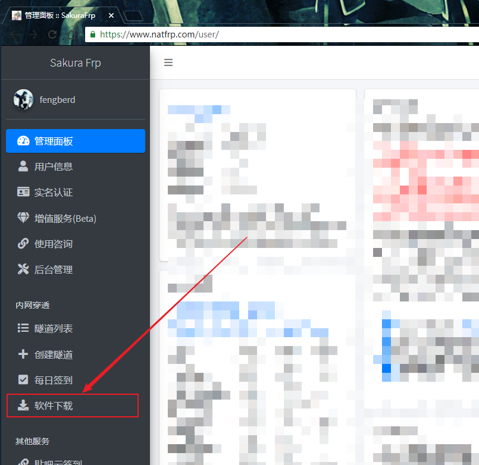
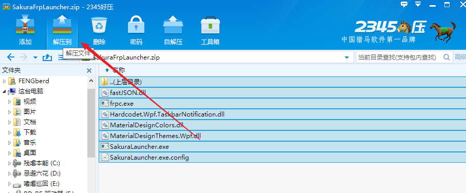
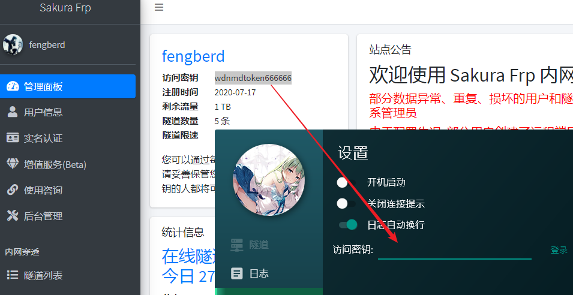
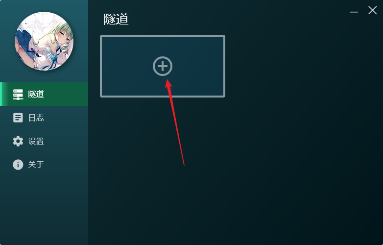

# 使用 Sakura Frp 启动器

> 本部分内容转载自管理员的博客《Sakura Frp 启动器使用指南》，有修改。
> 原文链接：<https://blog.berd.moe/archives/sakura-frp-launcher-user-guide/>

## 前言

[Sakura Frp](https://www.natfrp.com/) 是一个免费的内网穿透服务，其启动器由本人进行开发 & 维护. 受站长之托写一篇使用指南，请不要在 本文章/博客 评论区询问任何关于 Sakura Frp 的事宜，有问题请到 OWQ 进行咨询。

### 0x01 WPF启动器

首先，你需要从网站下载 WPF 启动器，在侧边栏点击 “软件下载” :

然后点这个，下载 WPF 启动器

下载完毕后解压到一个单独的文件夹，不要直接运行

解压完后用鼠标左键双击 SakuraLauncher.exe，或者 右键-&gt;选择 “打开”

到管理面板复制访问密钥，然后点击登录

登录成功后点击 “隧道” 标签

然后点击这个加号新建隧道

接下来选择你要映射的服务，本文以映射 `iperf3` 服务器为例，直接找到进程 `iperf3` 点击，然后选择一个服务器，最后点创建即可

创建成功后按需要选择是否继续创建

全部设置完毕后，返回主界面，点击这个开关启用隧道

启动成功后会有一个提示

记下这个地址，你也可以到日志标签复制 (别忘了点确定)

这样我们的服务就可以在外网被访问到了

如果 WPF 启动器能正常使用，请直接跳过下面的 0x02 章节，从 0x03 开始阅读

## 0x02 传统启动器

传统启动器是给一些打不开 WPF 启动器的用户使用的，正常系统不需要用这个.

下载、解压流程相同，在此不再赘述. 左键双击 LegacyLauncher.exe 或者 右键 -&gt;选择 “打开”

类似的，把你的访问密钥复制过来点登录

操作和 WPF 启动器基本一致，按流程创建隧道

创建好后勾选要启动的隧道即可开启，然后稍等一会

传统启动器是没有消息框提示的，请关注日志输出，获取到连接方式就可以使用了

