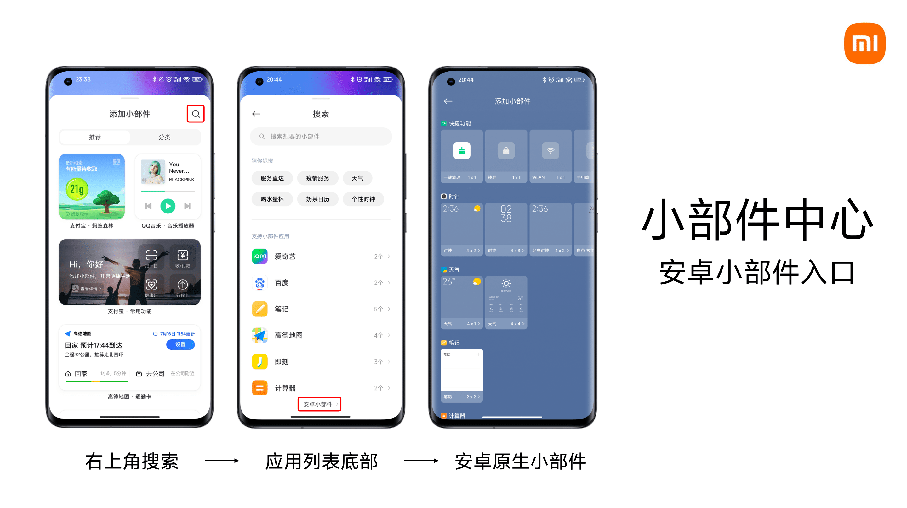

# 在手机上使用 SakuraFrp 认证代理微件

如果您已按照 [配置访问认证](/bestpractice/frpc-auth.md) 一节配置过访问认证功能，想必您会对于经常需要打开浏览器进行验证感到厌烦。

而 [认证代理程序](/offtopic/auth-guest.md) 又并不方便在手机上使用，因此我们为<ruby>安<rp>(</rp><rt>鸿</rt><rp>)</rp>卓<rp>(</rp><rt>蒙</rt><rp>)</rp></ruby>用户准备了 AuthWidget 应用作为示例，通过桌面微件（Widgets/小部件/小组件）快速通过访问认证。

您可以在 [GitHub Release](https://github.com/natfrp/auth-guest-android/releases/latest) 或者 [Nyatwork CDN](https://nya.globalslb.net/natfrp/client/auth-widget/) 下载 APK 文件。

## 快速使用说明

如果您看完简介没有意识到如何使用的话，我们为您准备了一个 40 秒的视频展示此应用程序的主要功能：

## 特定品牌使用补充说明

:::: tabs

@tab 华为

自某版本系统起，鸿蒙手机开始推广系统自相关的“系统卡片”，“弱化”了安卓标准小部件的入口。

当您在添加时，“建议您在桌面两指捏合，进入桌面编辑状态，点击服务卡片>窗口小工具（如下图），选择您需要的小工具并拖到桌面空白区域。”

（图片及引号内说明来自 [华为官方](https://consumer.huawei.com/cn/support/content/zh-cn15871857/)）

@tab 小米

MIUI 13 起，MIUI 开始使用全新的需要审核上架的 MIUI 小部件，隐藏了安卓标准小部件的入口。

您在添加时需要按照下图找到正确的小部件添加入口，此图来自 [小米官方](https://dev.mi.com/distribute/doc/details?pId=1588)。

@tab 三星

OneUI 5 后，OneUI 中存在一个 Bug，应用程序会收到错误的授权信息导致无法弹窗申请应用列表权限。

如果您需要使用内置的应用选择器，请在系统的应用权限列表中手动为 AuthWidgets APP 授权 **应用程序列表** 权限。

@tab 荣耀

Magic UI 6 起，Magic UI 会默认推广系统自相关的卡片小部件，隐藏了安卓标准小部件的入口。

当您在添加时，请：“请您在主屏幕双指捏合，选择**桌面卡片**，**滑动至底部**，点击并进入**经典小工具**，点击或拖拽您需要的小工具至桌面即可。”

（引号内说明来自 [荣耀官方](https://www.hihonor.com/cn/support/content/zh-cn00409513/)）

::::

## 高级使用说明

### 认证后打开的 URL {#redirect_url}

如果在 APP 中配置了此项目，同时隧道配置了 `auth_redirect` 配置项，将只有 APP 配置生效。

此选项支持任何系统已经注册的 URI scheme，如 "<https://natfrp.com>" 将使用系统中注册的浏览器打开。

手机中应用支持的 URI scheme 需要您到网上搜索，下面为您提供一些您可能需要的常用 URL：

| URL | 说明 |
| --- | --- |
| `minecraft://?addExternalServer=Name\|example.com:19132` | 打开 Minecraft 基岩版，并添加名字为 `Name` 地址为 `example.com:19132` 的服务器 |
| `rdp://full%20address=s:example.com:3389` | 打开远程桌面，并连接地址为 `example.com:3389` 的服务器 请参阅 [Remote Desktop URI scheme](https://learn.microsoft.com/en-us/windows-server/remote/remote-desktop-services/clients/remote-desktop-uri) 获取更多信息 |

我们欢迎您通过 [社区](https://github.com/natfrp/wiki/discussions) 或 [PR](https://github.com/natfrp/wiki/pulls) 与我们分享您常用的 URI scheme。

特别的，在 AuthWidget 应用中使用时，我们还支持下面两种链接：

| URL | 说明 |
| --- | --- |
| `open-app://com.natfrp.authguest` | 打开包名为 `com.natfrp.authguest` 的应用 |
| `open-activity://com.natfrp.authguest/MainActivity` | 打开包名为 `com.natfrp.authguest` 的应用中，名为 `MainActivity` 的活动 |
